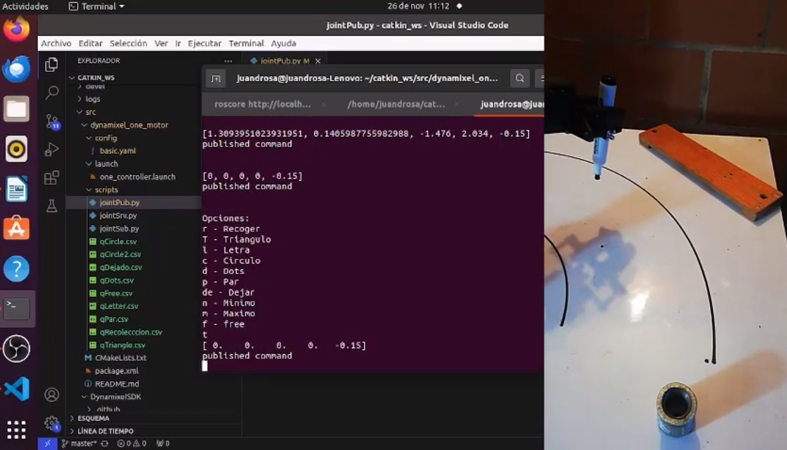

# Laboratorio 5 de Robótica: Cinemática Inversa
Integrantes:

***Eduardo Cuadros Montealegre***

***Oscar Javier Restrepo***

## Introducción

## Objetivos
- Determinar el modelo cinmático inverso del robot _Phantom X_.
- Generar trayectorias de trabajo a a partir del modelo cinemático inverso del robot.
- Implementar el modelo cinemático inverso del robot en MATLAB o Python.
- Operar el robot usando ROS a partir de trayectorias generadas en MATLAB o Python. 

## Cinemática Inversa
El problema cinemático inverso consiste en determinar la configuraci´on articular de un manipulador, dadas la posición y orientación del efector final respecto a la base. Este problema puede resolverse mediante m´etodos geométricos, algebraicos o numéricos. En el caso particular del robot Phantom X el cual posee 4 GDL, el enfoque más práctico
es combinar el método geométrico con el desacople de muñeca.

la cinemática directa se expresa con la tabla Denavit-Hatenberg.  

| Joint | Theta | d | a | alpha |
| -------- | -------- | -------- | -------- | -------- |
| 1  | q1     | 0    | 0 | pi/2 |
| 2  | q2     | 0    | 100 | 0 |
| 3  | q3     | 0    | 100 | 0 |
| 4  | q4     | 0    | 100 | 0 |


Para el cálculo de la cinemática inversa se tiene:
Del manipulador físico se encuentra la distancia 
$$h=106\ldotp 5\\ {mm}$$ 

Con este parámetro y la medida del eslabón del robot encontramos el cateto c y el ángulo $\delta \$.
$$c\;=\sqrt{h^2 -{100}^2 }=36\ldotp 6367\\textrm{mm}$$
$$\delta =\tan^{-1} \;\left(\frac{c}{100}\right)=20\ldotp 1212\degree$$
Para continuar con la solución del modelo, se encuentra la longitud del parámetro R para lo cual se debe encontrar la distancia $dz$.
$$\textrm{dz}=z_m -94\ldotp 4\;\textrm{mm}$$
$$R=\sqrt{x_w^2 +y_w^2 +{\textrm{dz}}^2 }$$
Conocida esta dimensión, podemos hallar los ángulos internos del triángulo, a través del teorema del coseno.
$$\alpha =\cos^{-1} \left(\frac{{100}^2 +r^2 -h^2 }{2\cdot 100\cdot r}\right)$$
$$\beta \;=\cos^{-1} \left(\frac{h^2 +r^2 -{100}^2 }{2\cdot r\cdot h}\right)$$
$$\gamma \;=\cos^{-1} \left(\frac{h^2 +{100}^2 -r^2 }{2\cdot 100\cdot h}\right)$$
Con estos ángulos conocidos, se utilizan relaciones geométricas que nos permitan encontrar el valor de los demás ángulos de la figura para de esta forma finalmente encontrar las posiciones angulares de las articulaciones del robot.
$$\theta =\sin^{-1} \left(\frac{\textrm{dz}}{R}\right)$$
$$\psi =180\degree -\alpha$$
$$\phi =180\degree -\psi -\theta$$

$$\omega =180\degree -\phi$$

$$\kappa =\omega -90\degree$$

Con lo que las posiciones angulares de las articulaciones del manipulador se encuentran determinadas por las ecuaciones.

$$q_2 =90\degree -\theta -\beta -\delta \;$$

$$q_3 =90\degree -\gamma +\delta \;$$

$$q_4 =\kappa -90\degree$$


## Ejercicio en el laboratorio

Primero se realiza el modelo de cinemática inversa del robot _Phantom X_. Para esto se usa el _Robotics Toolbox_ de MATLAB. Se realiza la tabla de parámetros Denavit-Hartenberg.

 ```
offset = [0 0 0 0];
conf = [0 0 0 0];
l1 = 93.5; l2=106.3; l3=99.2; l4=83.2;  % mm
q1 = conf(1)*pi/180 + offset(1);
q2 = conf(2)*pi/180 + offset(2);
q3 = conf(3)*pi/180 + offset(3);
q4 = conf(4)*pi/180 + offset(4);

DH2 = [0 0 0 pi/2;0 0 106.3 0;0 0 99.2 0;0 0 83.2 0];
L(1) = Link([0 0 0 pi/2 0]);
L(2) = Link([0 0 l2 0 0]);
L(3) = Link([0 0 l3 0 0]);
L(4) = Link([0 0 l4 0 0]);

Rob = SerialLink(L);
Rob.name = "Phantom X Pitcher"
Rob.plot([q1 q2 q3 q4],'noa')
 ```
## Matlab
Se arpovecha el poder de cómputo de Matlab para generar archivos CSV que almacenen la secuencia de los valores de las articulaciones. Cada línea representa un vector q.
### Para recoger el marcador:
```
px = 140;
py = -240;
zp = 80;
Recoleccion = zeros(6,5);
Recoleccion(1,:) = q0Op;
valor=215*sqrt(2)
zsi=20
[q1,q2,q3,q4,q5]=phinv(junaferdorilon*cosd(50),-valor*sind(50),110,0.2)
[q1,q2,q3,q4,q5]=phinv(junaferdorilon*cosd(50-100),-valor*sind(50-100),120,0.2)
param = [[px,py,zp+100,0.3];[px,py,zp,0.3];[px,py,zp,-0.15];[px,py,zp+100,-0.15]];
for i = 1:4
    [q1, q2, q3, q4, q5] = phinv(param(i,1), param(i,2), param(i,3), param(i,4));
    if(i==1 || i==4)
        q2=q2+pi/6;
    end
    Recoleccion(i+1,:) = [q1, q2, q3, q4, q5];
end
Recoleccion(6,:) = q0;
csvwrite('Recolecccion.csv',Recoleccion);
```
### Dejar el marcador
Se aprevecha la secuencia de recolección pero se organiza de manera inversa
```
qDejado = (fliplr(qRecoleccion'))';
csvwrite('qDejado.csv',qDejado);
```
### Triángulo
```
Triangle = zeros(length(xT)+4,5);
Triangle(1,:) = q0;
Triangle(end,:) = q0;
zT = 80;
for i = 2:length(qTriangle)-1
    if(i==2)
        param = [xT(1), yT(1), zT+50,-0.15];
    elseif(i==(length(qTriangle)-1))
        param = [xT(end), yT(end), zT+50,-0.15];
    else
        param = [xT(i-2), yT(i-2), zT,-0.15];
    end

    [q1, q2, q3, q4, q5] = phinv(param(1,1), param(1,2), param(1,3), param(1,4));
    if (i==(length(qTriangle)-1))
        Triangle(i,:) = [q1, q2+pi/6, q3, q4, q5];
    else
        Triangle(i,:) = [q1, q2, q3, q4, q5];
    end
end
Triangle;
csvwrite('Triangle.csv',Triangle)
```
### Letras
```
Letras = zeros(length(xL)+8,5);
Letras(1,:) = q0;
Letras(end,:) = q0;
zL = 80;
j = 1;
for i = 2:length(Letras)-1
    if((i==2)||(i==(4+5*N))||(i==(6+7*N)))
        param = [xL(j), yL(j), zL+50,-0.15];
    elseif((i==(3+5*N))||(i==(5+7*N)))
        param = [xL(j-1), yL(j-1), zL,-0.15];
    elseif(i==(length(Letras)-1))
        param = [xL(end), yL(end), zL,-0.15];
    else
        param = [xL(j), yL(j), zL,-0.15];
        j = j+1;
    end
    [q1, q2, q3, q4, q5] = phinv(param(1,1), param(1,2), param(1,3), param(1,4));
    
    if((i==(3+5*N))||(i==(5+7*N))||(i==(length(Letras)-1)))
    Letras(i,:) = [q1, q2+pi/6, q3, q4, q5];
    else
    Letras(i,:) = [q1, q2, q3, q4, q5];
    end
    
end
qLetter;
csvwrite('Letras.csv',Letras);

```


## Script de Python
Se crea la función para la cinemática inversa, hayando los valores de las articulaciones a partir de las coordenadas del TCP.

 ```
def phinv(x, y, z, q5):
    #Triangulo constante
    hipo=106.5; #distancia diagonal entre q2 y q3
    cate=np.sqrt(hipo**2-100**2) #cateto de la diagonal
    angle = np.arctan2(cate,100)
    
    q1=np.arctan2(y,x)
    
    dmar0 = np.array([[x], [y], [z]])
    d3 = np.multiply(np.array([[np.cos(q1)], [np.sin(q1)], [0]]),100)
    dw0 = dmar0-d3
    
    dz = dw0[2]-94
    r2 = (dw0[0])**2+(dw0[1])**2+(dz)**2
    r = np.sqrt(r2)
    
    #Teorema del coseno
    alpha = np.arccos((100**2+r2-hipo**2)/(2*r*100))
    beta = np.arccos((r2+hipo**2-100**2)/(2*r*hipo))
    gamma = np.arccos((hipo**2+100**2-r2)/(2*hipo*100))

    theta = np.arctan2(dz,np.sqrt((dw0[0])**2+(dw0[1])**2))
    psi = np.pi-alpha
    phi = np.pi-psi-theta
    omega = np.pi-phi
    kappa = omega-np.pi/2
    
    q2= np.round(np.pi/2-theta-beta-angle-np.pi/18,3)
    q3= np.round(np.pi-gamma-(np.pi/2-angle),3)
    q4 =np.round(-(np.pi/2-kappa),3)

    return [float(np.round(q1,3)),float(-q2),float(-q3),float(-q4),float(q5)]
 ```
Con esta función entran las coordenadas $x$, $y$ y $z$ del TCP, junto con la función que debe tener el gripper, es decir, si debe estar sujetando el marcador o no. Las siguientes dos funciones cumplen el objetivo de verificar rango máximo y mínimo del robot.

 ```
def rangoMin():
    radio = 70 *np.sqrt(2)
    angleI = np.pi/32
    x=radio*np.cos(angleI)
    y=-radio*np.cos(angleI)
    z=70
    q0 = [0,0,0,0,-0.15]
    q10 = phinv(x,y,z+30,-0.15)
    q1 = phinv(x,y,z,-0.15)
    #q2 = [q1[0]+np.pi/4,q1[1],q1[2],q1[3],-0.15]
    q3 = [q1[0]+2*np.pi/3,q1[1],q1[2],q1[3],-0.15]
    q4 = [q1[0]+2*np.pi/3,q1[1]+np.pi/6,q1[2],q1[3],-0.15]
    return [list(q0),list(q10),list(q1),list(q3),list(q4),list(q0)]

def rangoMax():
    radio = 215*np.sqrt(2)
    angleI = np.pi/8
    x=radio*np.cos(angleI)
    y=-radio*np.cos(angleI)
    z=80
    q0 = [0,0,0,0,-0.15]
    q10 = [-0.873,-0.838,0.954,0.059,-0.15]#phinv(x,y,z,-0.15)
    q1 = [-0.873,-0.917,0.914,0.177,-0.15]#phinv(x,y,z,-0.15)
    q2 = [0.873,-0.869,0.917,0.127,-0.15]
    q20 = [0.873,-0.869+np.pi/6,0.917,0.127,-0.15]
    #return [list(q0),list(q10),list(q1),list(q2),list(q20),list(q0)]
    return [list(q0),list(q10),list(q1),list(q2),list(q20)]
 ```
Estas funciones retornan los valores que debe tener cada articulación para dibujar los arcos que representan los limites de espacio de trabajo diestro.

Se crea un bucle while que se detiene cuando detecta que el robot está desconectado. En este bucle se inicia preguntando al usuario qué rutina desea iniciar.
 ```
 while not rospy.is_shutdown():
        print("Opciones:")
        print("r - Recoger")
        print("T - Triangulo")
        print("l - Letra")
        print("c - Circulo")
        print("n - Minimo")
        print("m - Maximo")

        key=input()
        if key == 'r' or key == 'R':
            llamado=qRecoleccion
            indice = 0
            key = ' '
        elif key == 't' or key == 'T':
            llamado=qTriangle
            key = ' '
        elif key == 'l' or key == 'L':
            llamado=qLetter
            indice = 2
            key = ' '
        elif key == 'c' or key == 'C':
            llamado=qCircle
            indice = 3
            key = ' '
        elif key == 'de' or key == 'DE':
            llamado=qDejado
        elif key == 'n' or key == 'N':
            llamado = rangoMin()
            key = ' '
        elif key == 'm' or key == 'M':
            llamado = rangoMax()
            key = ' '
        else:
            p1 = [0,0,0,0,-0.15]
            p2 = [0,0,0,0,-0.15]
 ```

Se utiliza la variable _llamado_ para seleccionar el conjunto de puntos que se le va a mandar al robot. Por lo tanto, si se quiere hacer una letra se oprime la tecla correspondiente en el teclado y la variable guardará el array que contiene los puntos. Finalmente se inicia un bucle _for_ que recorre el array y manda a cada articulación su valor correspondiente dinámicamente.
 ```
     for i in range (len(llamado)):
            state = JointTrajectory()
            state.header.stamp = rospy.Time.now()
            state.joint_names = ["joint_1", "joint_2", "joint_3", "joint_4", "joint_5"]
            point = JointTrajectoryPoint()
            point.positions = llamado[i]
            point.time_from_start = rospy.Duration(0.5)
            state.points.append(point)
            pub.publish(state)
            print(llamado[i])
            print('published command')
            rospy.sleep(3)
            print('\n') 
 ```
## Video demostrativo del funcionamiento
[](https://youtu.be/evDFgF7mxfM)

## Conclusiones

- Con este laboratorio se evidencia la importancia de tener un buen modelo de cinemática inversa para el robot con el que se trabaja, pues reduce significativamente el cálculo a realizar para las trayectorias. Ya que solo se tiene que calcular las coordenadas del TCP y el modelo se encarga de encontrar los valores de las articulaciones. Con su contraparte, la cinemática directa, se tendría que sacar para cada punto del TCP, 5 valores correspondientes a las articulaciones a mano.
